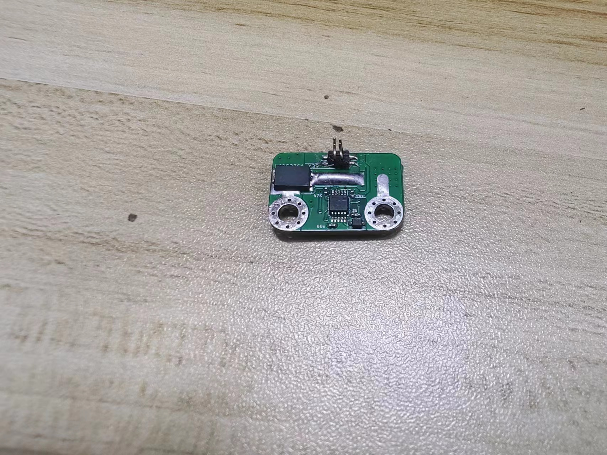
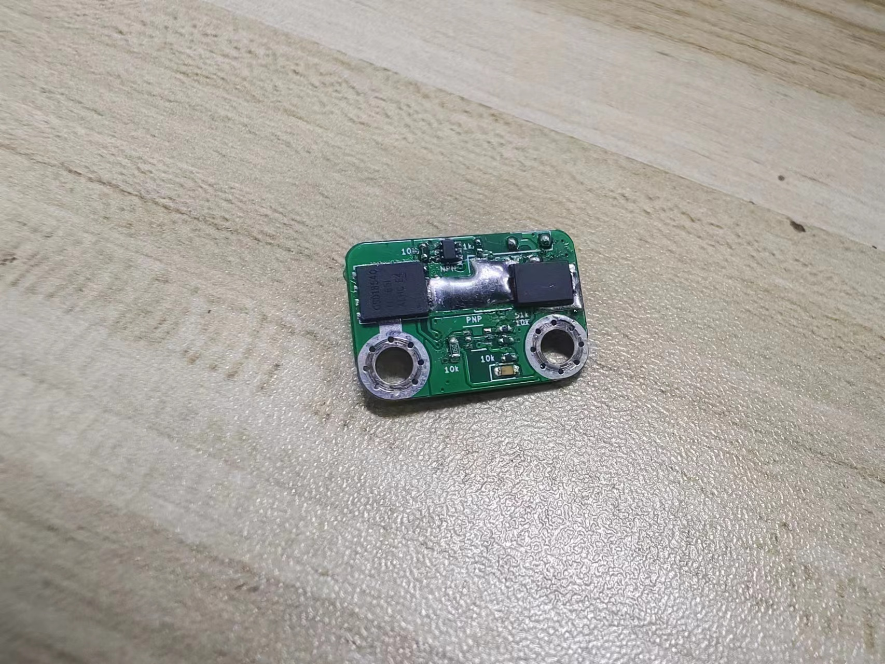
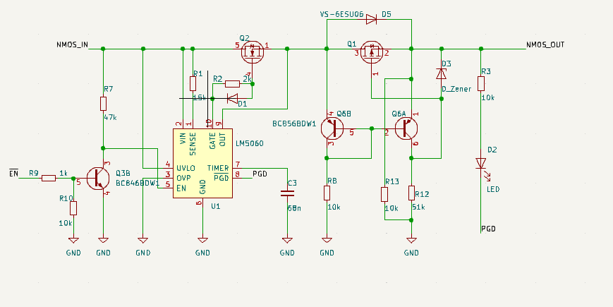

# RM_High-side switch_schottky

&nbsp;&nbsp;&nbsp;&nbsp;

[English](./README.md)/中文

***

### 简介

&nbsp;&nbsp;&nbsp;&nbsp;本项目的开发目的是为了实现了电位控制电流。本项目基于lm5060芯片，实现了控制电流开关的功能。

***

### 开发工具

+ EDA工具：KiCAD 7.0 

***

### 目录结构

+ circuit：基于KiCAD的原理图及PCB设计

+ docs：README相关的图片及文档

**注意：生产制造相关的Gerber、BOM、POS文件及程序固件均在仓库的Release中发布**

***

### 电路设计

#### 原理图设计要点

&nbsp;&nbsp;&nbsp;&nbsp;高侧开关的设计：通过三极管的共射放大电路，实现电位控制Nmos管的导通。在lm5060的OUT引脚后面还并联两个肖特基二极管，用来防止升压端的26v以上的电压反向给电池充电。在lm5060的GATE的引脚处串联了一个电阻再反并二极管实现电源快开关慢的作用。目前版本中理想二极管部分还不能稳定使用，所以先用肖特基二极管进行备用解决方案。

#### PCB布局布线要点

1. VIN旁路电容器靠近引脚VIN.
2. 计时器电容器靠近针脚TIMER.
3. MOS管处pcb打孔确保正反面导通

***

**组织：DynamicX  
维护人：陈晓根, 2383725658@qq.com**
